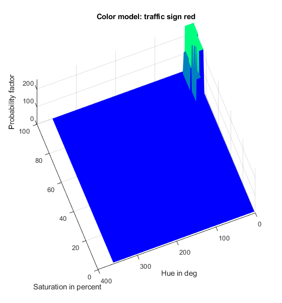
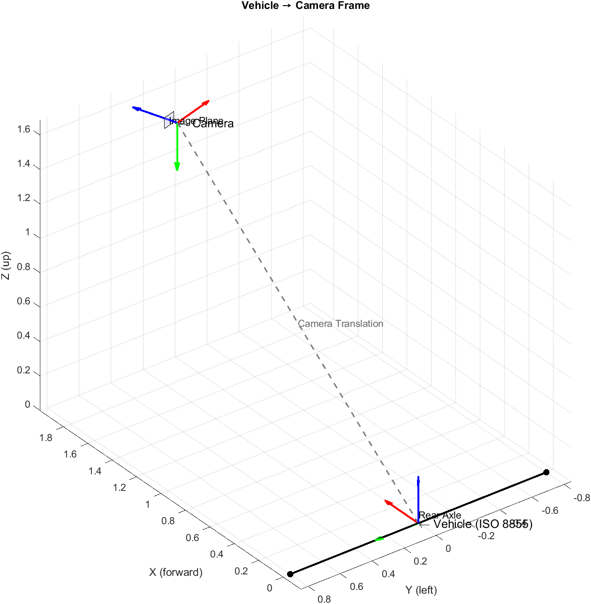
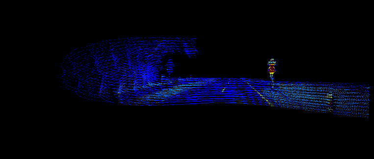
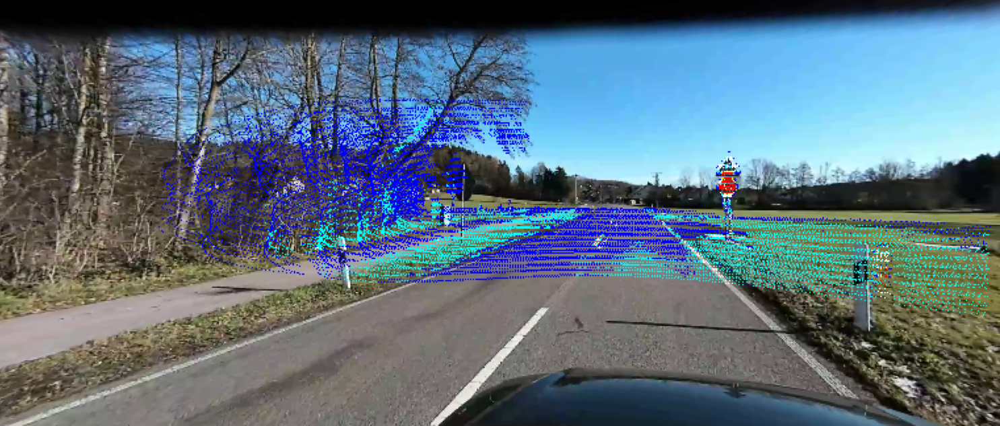

# Illumination-invariant image processing
This repository provides a Matlab-based software project that will be used in the lecture "Illumination-invariant image processing" in the course ***"Automotive Sensors and Actuators (ASAA)"*** in the summer term 2025. The presented slides can be found either in Teach Center or in this repository.

<a href="https://raw.githubusercontent.com/schneider-daniel/ASAA/master/lecture/ASAA_image_proc.pdf" target="_blank" rel="noopener noreferrer">Lecture slides</a>

The provided software can be used to address robust (with respect to different lighting situations) segmentation, e.g. to identify a potentially drivable area in front of a car. Furthermore, we demonstrate the application of the pinhole camera model to determine the distance of an object identified (using YOLOV4/Darknet) in front of the camera. Assuming that the object fits in the ground plane (Z=0), we can estimate the distance (X, Y) of the object (from pixel) with a monocular camera system. In addition, by means of a so-called color-model, we segment defined colored objected in the image. To get a better understanding of the transformations within the different coordinate systems, we will also visualize the translation between the different systems. Another example is the projection of 3D points from LiDAR onto a 2D image plane.

<p align="center">
  
</p>

## Road segmentation
The goal of road segmentation is to identify and segment areas in front of the vehicle with the same color information that was taken from a sample in front of the vehicle. This segmentation follows the flowchart below. However, we will not implement shadow refinement in this software project.

<p align="center">
    
</p>

### Color space convertion
The color space (HSI) which builds from Hue, Saturation and Intensity is used. It is determined according to [Sotelo et al.](https://link.springer.com/article/10.1023/B:AURO.0000008673.96984.28) as the follows: 

$$H = \Theta \text{ if } B_i \leq G_i, \text{ else }  360 - \Theta$$ 

$$\Theta  = \cos^{-1} \left(\frac{\frac{1}{2}(R_i - G_i) + (R_i - B_i) }{\sqrt{(R_i - G_i)^2 + (R_i - B_i)(G_i - B_i)}} \right)$$

$$S_i = 1 - \frac{\min(R_i, G-I, B_i) }{I_i}$$

$$I_i = \frac{R_i + G_i + B_i}{3}$$

The aim of this color space conversion is to display chromaticity and saturation on the known color wheel. The intensity is represented as the height of the resulting double-peaked cone. 

<p align="center">
    
</p>

### Color pattern
The road color pattern is extracted in an region of interest (ROI) in front of the vehicle, defined as ``` 300, 80, 550``` whereby ``` 300 ``` represents the width, ``` 80 ``` the height of the region and ``` 550 ``` the offset from the image bottom in pixel.

## Probability-based color segmentation
Probability-based color segmentation applies the above idea by segmenting image areas according to their color information. For this purpose, a color model is created that represents the 2D chromaticity plane of the HSI color space. The color model thus results in a grayscale image with the dimension 360 x 100 px, since the hue values are given by $0 \ldots 360 $ deg and the saturation values by $0 \ldots 100 $ %. It is generated by averaged color samples. The implementation is given in ```./src/colormodel.m```.

### Color model generation
The color model is generated using color samples by extracting the averaged saturation and chroma for each sample and voting for the extracted color value at the appropriate point on the empty color model. Subsequent blurring using Gaussian produces the following example color model for the color red, generated from 20 color samples. 
<p align="center">
    
</p>

The occurrence frequency can be represented in the 3D plane as follows: 
<p align="center">
    
</p>

### Application

The application of the color model is correspondingly simple. For each pixel $(i, j)$ in the given image $\mathcal{I}$, the occurance probability is taken from the color model $\mathcal{CM}$ by pointing to the position 

$$\mathcal{CM}(\text{Hue}(\mathcal{I}(i, j)), \text{ Sat}(\mathcal{I}(i, j)))$$ 

for the respective pixel in the image. The corresponding call in Matlab looks like: 

```mask(i, j) = cm(H(i, j), S(i, j));```

The result is a greyscale mask whose normalized values between 0 and 1 correspond to the membership probability for $\mathcal{I}(i, j)$ given $\mathcal{CM}$. 

A result of the applied segmentation is given below.
<p align="center">
  
  
</p>
By using an threshold, it is possible to optimize the segmentation.


### Transformations
For a better understanding, the relationship between the camera and the reference system must first be understood. The reference system in the ADAD/AD area is often the projection surface of the rear axle center point on the road surface, based on ISO 8855. For the transformation between the camera and vehicle coordinate system, both the offset and the rotation must be considered. The rotation of the system is important at this point. It is not only rotated by a few degrees but the X-axes point in other directions by definition.
<p align="center">
    
</p>

### Lidar to camera projection
As data fusion between different sensors reduces uncertainties, data fusion between camera and LiDAR is preferred. This involves a projection from the 3D world into the 2-dimensional image. Here we use a different approach: the image is already undistorted and the camera matrix is recalculated accordingly.

**Camera Intrinsics**:
  ```
  [[307.43, 0.00, 387.17],
   [0.00, 304.43, 157.75],
   [0.00, 0.00, 1.00]]
  ```

**Translation**:
 ```[-0.167; 1.685; -1.587] ```

 **Rotation**
 ``` 
 [[0.30389705, -0.95224289, -0.02966584],
   [-0.02329885,  0.02370089, -0.99944757],
   [0.95241995,  0.30442035, -0.01498354]],
  ```

The required transformation between the LiDAR and the camera follows the example above. Since the point cloud is related to the origin of the vehicle system (ISO 8855), we can use the same transformation. However, this is often not the case. Often there is a relationship between the camera position and Lidar position and projected relative to each other.
#### Input data: 
The given point:


Undistorted image:


#### Output data:
The result is a 2D camera image overlaid with LiDAR points color-coded by intensity:

The projection requires fine-tuning - for sure!

## Software requirements
All functions are implemented and tested using either Matlab 2024a or Python 3.8.19.

## Literature
- [Rotaru et al.](https://link.springer.com/article/10.1007/s11554-008-0078-9)
- [Sotelo et al.](https://link.springer.com/article/10.1023/B:AURO.0000008673.96984.28)
